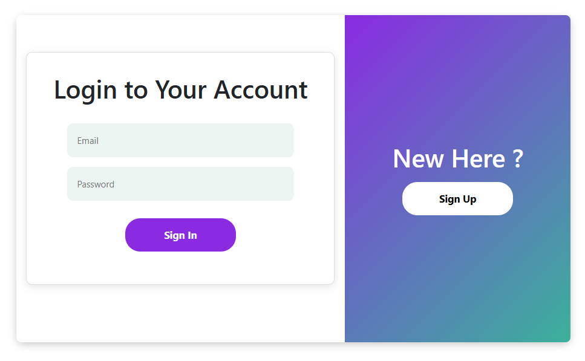
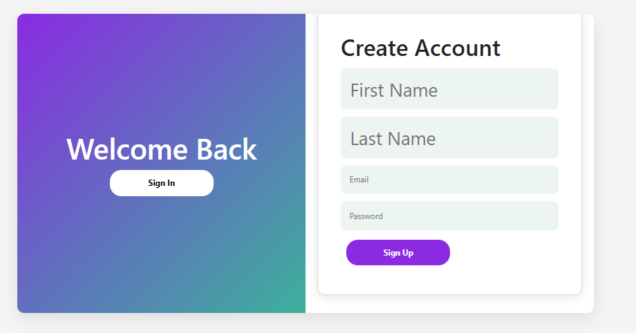
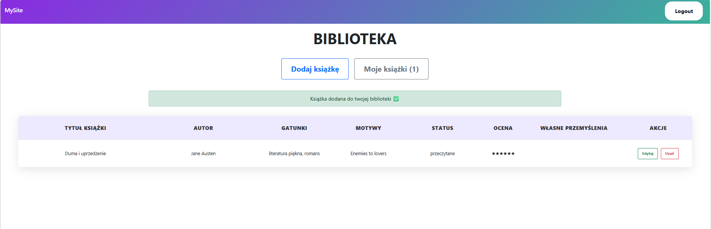
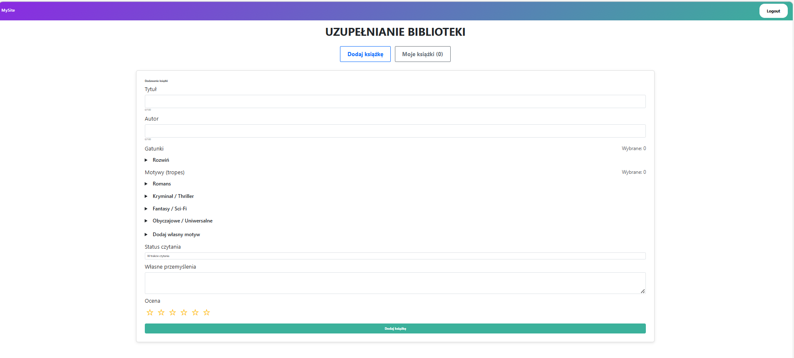
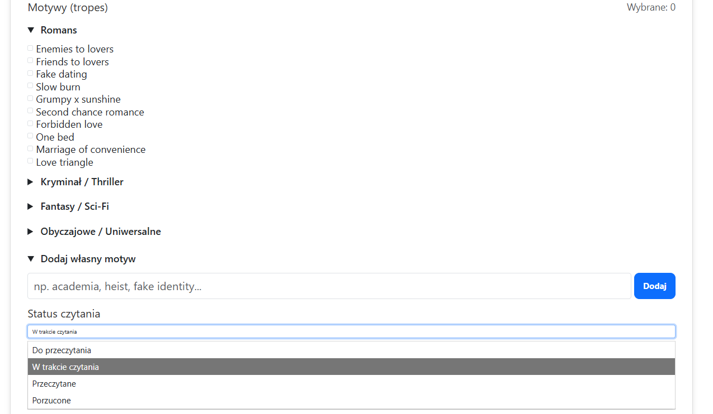

Aplikacja "Moja biblioteka"
## Autor: Julia Szymczyk

## Zrzuty ekranu
### Logowanie

### Rejestracja

### Widok książek

### Dodawanie książki

### Opcje

## Funkcjonalności:
- uwierzytelnianie
- rejestracja i logowanie użytkowników
- dodawanie książek do własnej biblioteki
- edycja i usuwanie książek
- przypisywanie gatunków i motywów przewodnich
- dodawanie własnych przemyśleń/notatek na temat książek
- ocenianie książek (skala 0-6)
- wyświetlanie listy książek tylko dla zalogowanego użytkownika

## Narzędzia i technologie:
- strona serwera: Node.js, Express
- baza danych: MongoDB, Mongoose
- strona klienta: React

Wersje programów wykorzystane do tworzenia aplikacji (aplikacja nie została przetestowana z kompatybilnością wcześniejszych wersji):
- Node.js v22.20.0
- MongoDB Atlas
- react-scripts 5.0.1
- Express 5.2.1
- Mongoose 9.1.2
## Uruchomienie
1. Otworzyć projekt w Visual Studio Code
2. Otworzyć dwa terminale: jeden w folderze 'client', drugi w folderze 'server'
3. W obydwu terminalach wykonać instalację zależności 'npm install'
4. Uruchomić aplikację poprzez 'npm start' w obydwu folderach 'client' i 'server'
5. Aplikacja kliencka uruchomi się w przeglądarce (domyślnie http://localhost:3000), a serwer backendowy będzie pod adresem http://localhost:3001
## Uwagi
Serwer (folder server) musi być uruchomiony, aby aplikacja działała poprawnie. 
Klient (folder client) komunikuje się z backendem poprzez API.
## Konta testowe
Login: testowy@wp.pl 
Hasło: Testowe_konto123
